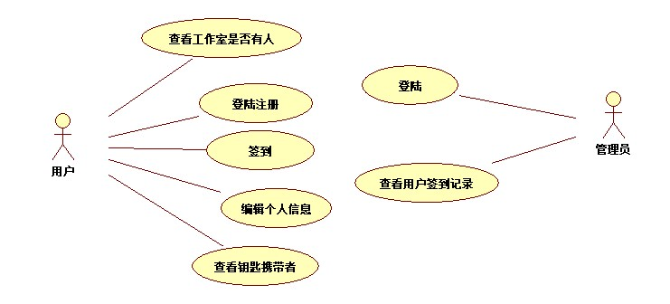

# 签到系统需求说明文档1.0.0

#### 一、系统简介

**系统任务需求：**

- 用户进行签到
- 用户登陆注册
- 用户信息编辑
- 查看签到记录
- 查看工作室有人与否
- 用户迁出
- 查看钥匙携带者

**系统范围**

用户通过手机浏览器打开签到系统，进行签到，管理员可通过浏览器打开签到系统后台导入签到记录

#### 二、用例图

#### 三、用例表

| 用例标识和名称 | 用户登陆                                              |
| -------------- | ----------------------------------------------------- |
| 描述           | 用户经行登陆签到系统                                  |
| 参与者         | 用户                                                  |
| 优先级         | 基本的                                                |
| 非功能性需求   | 安全性，进行token验证                                 |
| 前置条件       | 系统登陆页面已被打开                                  |
| 触发条件       | 用户进入工作室进行打开手机签到                        |
| 主事件流       | 1输入账号和秘密  2 经行图形验证码验证 3点击登陆 |
| 可选事件流 1.a | 检验cookie的有效性，如果cookie有效跳转到登陆成功      |
| 可选事件流 1.b | 账号不存在，提示用户账号不存在，请进行注              |
| 后置条件       | 用户登场成功进入首页                                  |
|                |                                                       |

| 用例标识和名称 | 用户注册                                                     |
| -------------- | :----------------------------------------------------------- |
| 描述           | 用户通过本例进行注册                                         |
| 前置条件       | 用户已经成功打开注册首页                                     |
| 触发条件       | 用户点击注册按钮                                             |
| 主事件流       | 1输入账号密码 2验证两次输入密码一致 3输入注册码 4输入验证码 5提交 |
| 可选事件流 2   | 两次密码不一致，提示用户检查两次密码一致                     |
| 可选事件流 3   | 注册码错误，无法注册，提示用户注册码错误                     |
| 后置条件       | 注册成功，跳转到登陆页面                                     |

| 用例标识和名称 | 用户查看工作室是否有人                                       |
| -------------- | :----------------------------------------------------------- |
| 描述           | 用户通过本例查看工作室是否有人                               |
| 前置条件       | 用户已经成功打开系统首页                                     |
| 触发条件       | 用户点击查看页面                                             |
| 主事件流       | 1点击链接跳转到工作室页面 2查询工作室在线人数 3返回工作室在线人数  |
| 后置条件       | 在工作室页面显示在线人数                                     |

| 用例标识和名称 | 用户签到                                                 |
| -------------- | -------------------------------------------------------- |
| 描述           | 用户通过本例经行打卡签到                                 |
| 前置条件       | 用户已经成功登陆                                         |
| 触发条件       | 用户点击签到                                             |
| 主事件流       | 1点击签到按钮 2检查用户定位 3签到成功              |
| 可选事件流 2a  | 用户定位不符合，签到失败，系统提示定位不符合结束本用例   |
| 后置条件       | 用户签到成功，签到表增加本条记录，在工作室人员增加本用户 |

| 用例标识和名称 | 用户签出                                                     |
| -------------- | ------------------------------------------------------------ |
| 描述           | 用户通过本例经行打卡迁出                                     |
| 前置条件       | 用户已经成功签到                                             |
| 用例标识和名称 | 用户迁出                                                     |
| 触发条件       | 用户点击迁出按钮                                             |
| 主事件流       | 1点击迁出按钮 2检查用户定位 3检查用户签到时长是否大于80分钟 4迁出成功 |
| 可选事件流 2a  | 用户定位不符合，签到失败，系统提示定位不符合结束本用例       |
| 可选事件流 3a  | 用户签入时间不符合，签出失败，系统提示签入时间不足           |
| 后置条件       | 用户签到成功，签到表增加本条记录，在工作室人员增加本用户     |

| 用例标识和名称 | 用户查看工作室是否有人                                       |
| -------------- | :----------------------------------------------------------- |
| 描述           | 用户通过本例查看工作室是否有人                               |
| 前置条件       | 用户已经成功打开系统首页                                     |
| 触发条件       | 用户点击查看页面                                             |
| 主事件流       | 1点击链接跳转到工作室页面 2查询工作室在线人数 3返回工作室在线人数  |
| 后置条件       | 在工作室页面显示在线人数                                     |

| 用例标识和名称 | 用户查看工作室钥匙携带者                                     |
| -------------- | :----------------------------------------------------------- |
| 描述           | 用户通过本例查看工作室钥匙携带者                             |
| 前置条件       | 用户已经成功打开系统首页                                     |
| 触发条件       | 用户点击查看工作室钥匙携带者页面                             |
| 主事件流       | 1点击链接跳转到工作室携带者页面 2查询工作室钥匙携带用户信息 3返回工作室在钥匙携带者信息  |
| 后置条件       | 在工作室携带者页面显示钥匙携带者信息                         |

| 用例标识和名称 | 管理员查询用户签到次数           |
| -------------- | :------------------------------- |
| 描述           | 管理员通过本例查看用户签到记录   |
| 前置条件       | 系统页面已打开                   |
| 触发条件       | 用户点击登陆                     |
| 主事件流       | 1查询最近一周签到记录         |
| 后置条件       | 将用户签到记录显示在管理员页面上 |